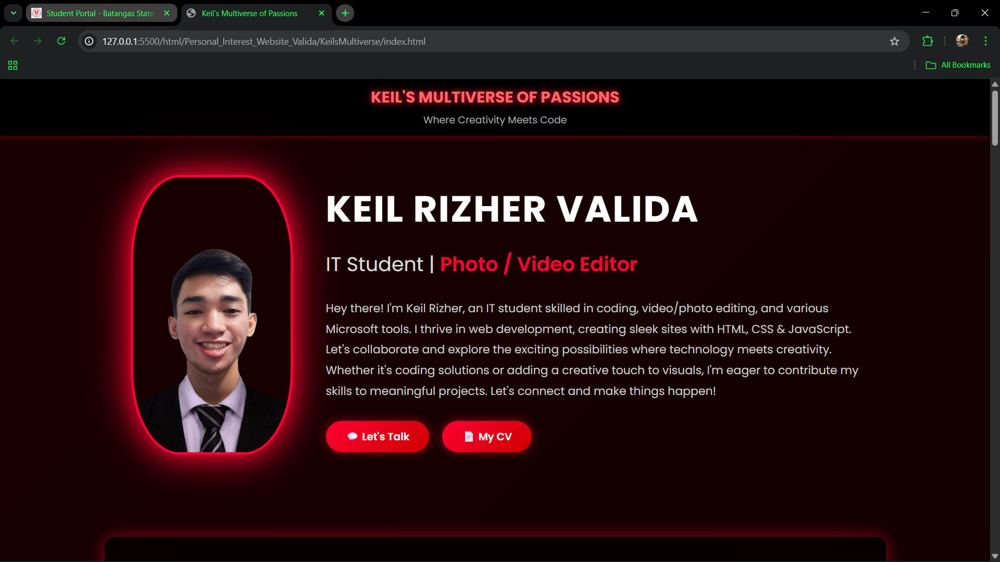
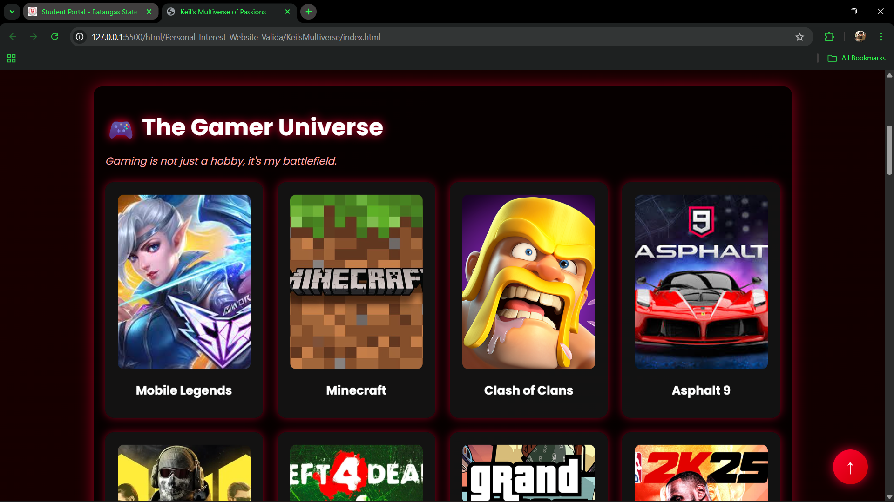
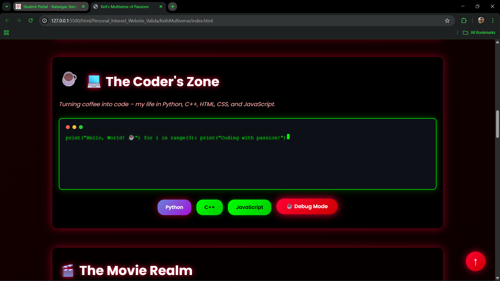
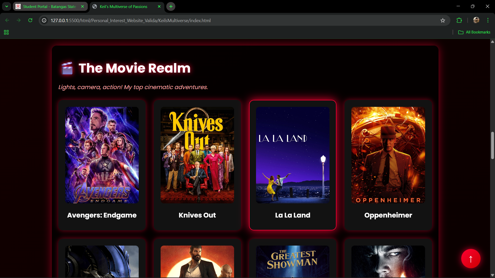
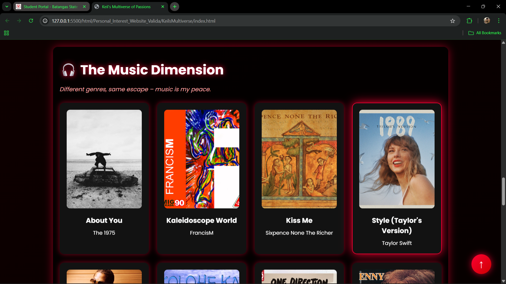
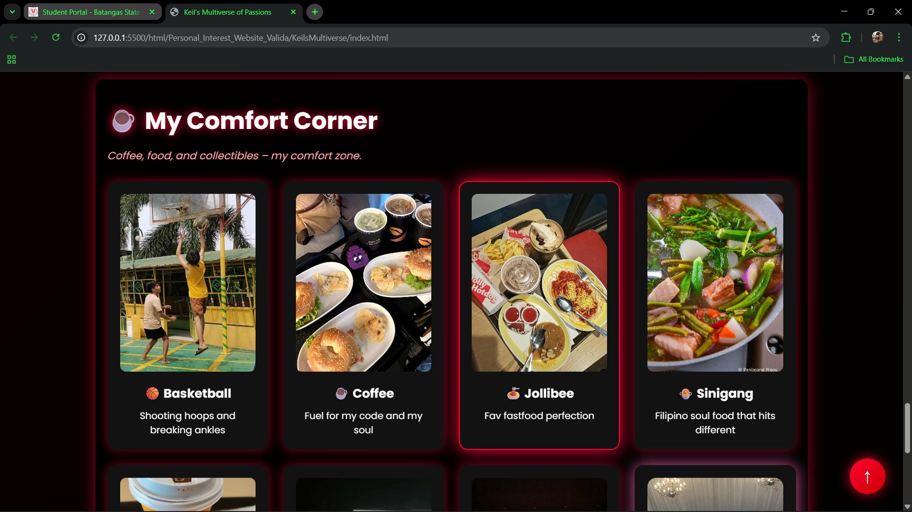

# **Keil’s Multiverse of Passions - Portfolio Website**
IT 314 – WEB SYSTEMS AND TECHNOLOGIES

## 📖 Overview
This project is a **Personal Interest Webpage** showcasing my hobbies and passions using **HTML**, **CSS**, and **JavaScript**.  
The design uses neon-red → black gradients, glowing effects, interactive popups, and an animated coder terminal to reflect a gamer–programmer–music-lover vibe.

---

## 🎯 Objectives
- Build a single-page website using HTML, CSS, and JavaScript.  
- Present personal interests in separate sections with images and captions.  
- Apply custom fonts, RGBA colors, gradients, rounded boxes, and simple JS interactivity.

---

## 🧩 Features
✅ **Header / Topbar** — Title, subtitle, and short intro.  
✅ **Gamer Universe** — Favorite games with clickable cards and neon popups.  
✅ **Coder’s Zone** — Animated terminal, language buttons, and a debug popup.  
✅ **Movie Realm** — Movie grid; clicking opens a cinematic popup with rating.  
✅ **Music Dimension** — Song cards (audio-ready) with a music popup.  
✅ **My Comfort Corner** — Food, coffee, Marvel, basketball and a personal photo.  
✅ **Back to Top** button, smooth scrolling, and responsive layout.

---

## 🖼️ Webpage Sections (with screenshots)

### 1. Header / Topbar
> **Description:** Displays my name, tagline, and short introduction about me.  

---
---

### 2. The Gamer Universe (Section 1)
> **Description:** Shows favorite games with figure/figcaption. Cards open styled popups.  

---
---

### 3. The Coder’s Zone (Section 2)
> **Description:** Animated terminal-like area with language buttons and a debug popup. 

---
---

### 4. The Movie Realm (Section 3)
> **Description:** Grid of favorite movies; clicking opens a neon-styled cinematic popup.

---
---

### 5. The Music Dimension (Section 4)
> **Description:** Song cards with audio tags and a popup that shows song info + progress.  

---
---

### 6. My Comfort Corner (Section 5)
> **Description:** Represents my love for coffee, relaxation, and comfort zone. 

---
---

## 🧠 Technologies Used
| Technology | Purpose |
|---|---|
| **HTML5** | Page structure (sections, figure & figcaption) |
| **CSS3** | Styling, RGBA, linear-gradient, animations, responsive layout |
| **JavaScript (ES6)** | Popup logic, terminal typing animation, scroll button |
| **Google Fonts (Poppins)** | Typography |
| **Images / Audio** | Visuals for cards; audio elements for music cards |

---
---

## ⚙️ How to Run the Project
1. Clone or download the repository.  
2. Make sure the folder structure matches below.  
3. Open `index.html` in your browser (or use **Live Server** extension in VS Code).

**Optional:** If using Live Server: right-click `index.html` → *Open with Live Server*.

---

## 🧑‍💻 Author
- Keil Rizher R. Valida
- ✉️ Email: 23-02166@g.batstate-u.edu.ph
- 🌐 GitHub: [keirzhr](https://github.com/keirzhr)

  
© 2025 All Rights Reserved

